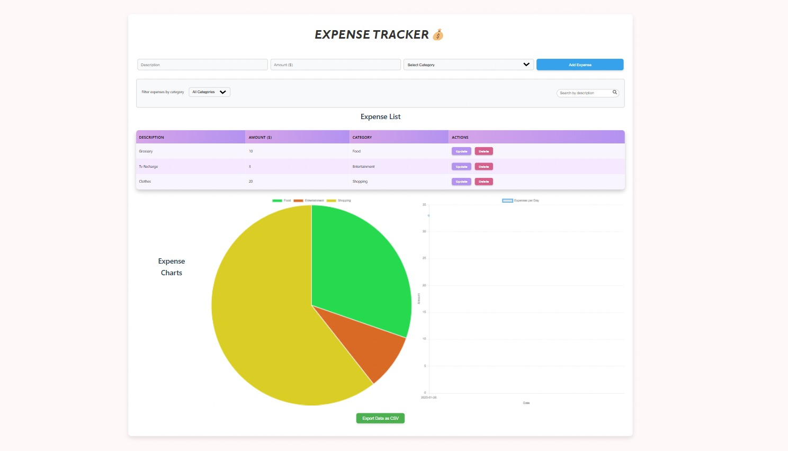

# Expense Tracker 💰



A simple **Expense Tracker** application built using **HTML5, CSS3, and JavaScript**. This project helps users efficiently manage their **daily expenses and income** by providing an easy-to-use interface and **LocalStorage** for data persistence.

## 🌟 Features:

- ✅ Add and remove expenses
- ✅ Displays list of expenses with category.
- ✅ Data stored using **LocalStorage** (persists even after page refresh)
- ✅ Interactive and responsive UI
- ✅ Search functionality
- ✅ Data visualization using pie-chart and line graph

## 📂 Technologies Used:

- **HTML5** – Structure of the app
- **CSS3** – Styling and responsiveness
- **JavaScript** – Application logic
- **LocalStorage** – Data storage

## 🚀 How to Use:

1. Clone the repository:
   ```bash
   git clone https://github.com/Dipali2377/ExpenseTracker.git
   ```
